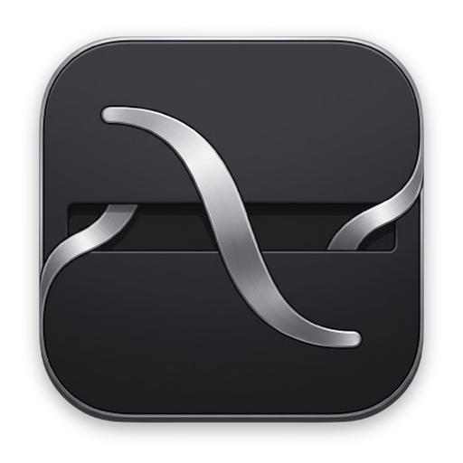
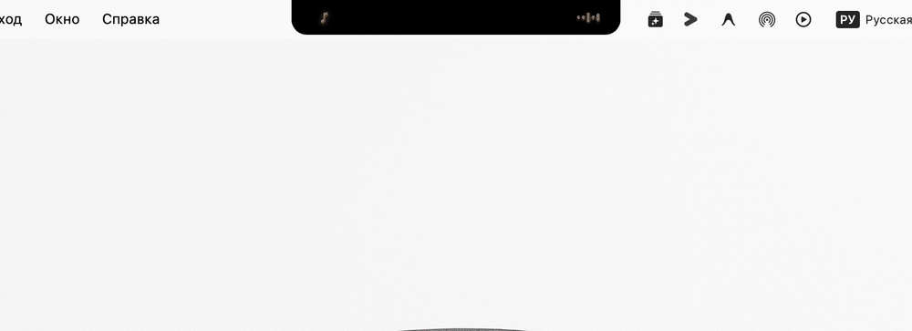

<div align="center">



# 🚀 VibeNotch

**The Ultimate AI & Developer HUD for the MacBook Notch**  
*Многофункциональный смарт-вырез для разработчиков, криейторов и вайбкодеров*

<p align="center">
  <a href="#-русская-версия"></a>
  <a href="#-english-version"></a>
  
  
</p>

---

[🇷🇺 **Русская версия**](#-русская-версия) | [🇬🇧 **English Version**](#-english-version)

---

<br/>



<br/>

</div>

<a name="-русская-версия"></a>
## 🇷🇺 Русская версия

> ### 💫 Напутствие начинающим вайбкодерам:
> **Вайбкодинг - это не просто написание кода, это воплощение чистой мысли и идей в реальность!**  
> Мы живем в потрясающее время: сегодня вам больше не нужно годами зубрить документацию и шаблонный синтаксис, чтобы создавать полезные, красивые и сложные приложения. Современный искусственный интеллект стал нашим универсальным напарником. Ваши главные суперсилы теперь - это **воображение, вкус, насмотренность и смелость пробовать новое**.  
> Не бойтесь ошибок, экспериментируйте, ломайте старые рамки и создавайте то, чем сами хотите пользоваться каждый день. Кайфуйте от процесса, ловите вайб и верьте в свои силы - у вас всё обязательно получится! 🚀✨

---

### ⚡️ Ключевые возможности

#### 1. 📂 Smart File Shelf (Умная полка файлов)
* **Drag & Drop:** Перетаскивайте файлы прямо в область выреза экрана из любой программы или Finder.
* **Конвертер изображений:** Быстрая конвертация картинок в форматы WebP и PNG в 1 клик.
* **Data URI / Base64:** Копирование `data:image/...;base64,...` в буфер обмена для использования в CSS, фронтенде и LLM-промптах.
* **Калькулятор токенов:** Автоматическая оценка веса текста и кода в токенах (`~tok`) перед отправкой в нейросети.
* **Интеграция с системой:** Быстрая отправка через нативный AirDrop и открытие файла в Finder.

#### 2. 📋 Developer Clipboard & Quick AI (Буфер обмена с ИИ)
* **История сниппетов:** Удобная лента скопированного кода и текста с поиском.
* **Security Filter (Защита ключей):** Автоматическая фильтрация и маскирование паролей, токенов и секретных ключей (`sk-`, `ghp_`, `AIzaSy`, JWT). Ключи никогда не утекают в историю и хранятся исключительно в защищенном хранилище Apple Keychain.
* **Быстрые действия с ИИ (Quick AI Actions):**
  * *«Объяснить»* - подробный разбор логики функции или текста ошибки.
  * *«Саммари»* - моментальная выжимка сути текста.
  * *«RU ↔ EN»* - мгновенный перевод с автоопределением языка.
* **Промпт-бар:** Прямой чат с моделями ИИ прямо из выпадающей шторки.

#### 3. 📸 Screen OCR & Скриншоты (Локальное распознавание текста)
* **Захват области экрана (Screen to Text):** Удобная рамка выделения фрагмента экрана с автоматическим скрытием панели нотча, чтобы она не мешала обзору.
* **Локальный Apple Vision:** Быстрое распознавание текста на русском, английском, китайском и других языках. Работает **100% офлайн, локально на процессоре Apple Silicon**, без отправки картинок на внешние серверы.
* **Автоматическое копирование:** Текст моментально попадает в буфер обмена и сохраняется в истории.

#### 4. 🎵 Music HUD & Dynamic Waveform (Музыка в вырезе)
* **Живой эквалайзер:** Плавная анимация звуковой волны в компактном вырезе при воспроизведении музыки.
* **Управление треками:** Поддержка Spotify и Apple Music — обложка, название трека, артист и кнопки управления воспроизведением.

#### 5. ⏱ Фокус-таймер и Помодоро
* Встроенный таймер для работы короткими спринтами (25 мин Помодоро, 15 мин, 5 мин).
* Индикация оставшегося времени прямо на компактной плашке выреза с мягким ненавязчивым звуковым уведомлением.

#### 6. 📊 AI Quota Tracker & Будильник лимитов
* Отслеживание лимитов популярных AI-провайдеров с обратным отсчетом до сброса лимита.
* **Умный будильник:** В 1 клик ставит будильник в стандартном приложении «Часы» macOS ровно на время сброса лимита (например, через 3 часа), чтобы вы не пропустили момент восстановления квоты.

#### 7. 🌐 Web Tools & Кастомный мониторинг
* Быстрый доступ к локальным веб-серверам (`localhost:3000`), репозиториям и дашбордам.
* Поддержка пользовательских виджетов и веб-статусов.

---

### 🛠 Сборка и запуск

#### Требования
* macOS 14.0 (Sonoma) или новее
* Xcode Command Line Tools (`xcode-select --install`)
* Swift 5.9+

#### Установка:
```bash
# Клонируйте репозиторий
git clone https://github.com/qawwali6969/VibeNotch.git
cd VibeNotch

# Соберите и упакуйте .app бандл
./package.sh

# Запустите приложение
open build/VibeNotch.app
```

При первом запуске разрешите приложению доступ к **Записи экрана** в *Системных настройках → Конфиденциальность и безопасность* (необходимо для работы инструмента OCR и создания скриншотов).

---

### 🔒 Безопасность и защита данных

VibeNotch спроектирован с философией **Zero-Trust** и максимальной приватности данных разработчика:

* 🔐 **Аппаратная защита Apple Keychain & Secure Enclave:**  
  Ваши API-ключи (OpenAI, Claude, Gemini, Z.ai, сессионные куки) **никогда не сохраняются в открытом виде** в обычных файлах (`UserDefaults`, `.json` или `.plist`). Все секреты шифруются и записываются напрямую в системное хранилище **Apple Keychain**, использующее аппаратную защиту Secure Enclave вашего Mac.
* 🛡 **Умный фильтр буфера обмена (Clipboard Security Filter):**  
  VibeNotch автоматически сканирует копируемый текст на наличие чувствительных данных. Если вы копируете приватные SSH-ключи (`BEGIN OPENSSH`), токены GitHub (`ghp_`, `gho_`), ключи нейросетей (`sk-`, `AIzaSy`), токены авторизации JWT или пароли — приложение **мгновенно отфильтровывает их и запрещает сохранение в историю буфера**. Ваши секреты никогда не засветятся на экране при показе выреза коллегам или на стриме.
* 💻 **100% Локальные вычисления (On-Device Processing):**  
  Оптическое распознавание текста (OCR) работает на базе встроенного Apple Vision Framework и выполняется локально на Neural Engine чипов Apple Silicon. Ни один ваш скриншот, фрагмент экрана или файл не отправляется на сторонние сервера для обработки.
* ⚙️ **Прозрачный контроль прав (macOS TCC):**  
  Доступ к записи экрана и управлению часами строго изолирован нативной системой контроля разрешений macOS (Transparency, Consent, and Control). Приложение имеет постоянную цифровую подпись разработчика.
* 🚫 **Zero Telemetry (Полное отсутствие трекинга):**  
  В коде полностью отсутствуют аналитические трекеры, телеметрия или скрытые сетевые запросы. Только то, что нужно вам для работы.

---

<br/>

<a name="-english-version"></a>
## 🇬🇧 English Version

> ### 💫 A Special Note to Fellow Vibe-Coders:
> **Vibe-coding is not just about writing code - it's about turning pure thought and creative energy into reality!**  
> We are privileged to live in an unprecedented era: you no longer need years of rote memorization or boilerplate mastery to ship gorgeous, complex, and delightful software. Modern AI models act as your infinite pair programmers. Today, your greatest superpowers are your **taste, vision, curiosity, and the courage to build**.  
> Don't be afraid to break things, experiment relentlessly, and create tools you genuinely love using every day. Catch the vibe, embrace the flow, and ship the future! 🚀✨

---

### ⚡️ Features

#### 1. 📂 Smart File Shelf
* **Drag & Drop:** Drop files directly into the top screen edge/notch area from any macOS app or Finder.
* **Smart Converter:** Convert images into WebP or PNG with a single click.
* **Data URI / Base64:** Instant `data:image/...;base64,...` clipboard copying for frontend development and multimodal LLM prompts.
* **Token Estimator:** Real-time token count estimation (`~tok`) for text and code snippets.
* **System Integrations:** Instant native AirDrop sharing and "Reveal in Finder".

#### 2. 📋 Developer Clipboard & Quick AI
* **Snippet History:** Clean searchable history of your copied code and text snippets.
* **Security Filter:** Proactively detects and redacts secrets, tokens, and private keys (`sk-`, `ghp_`, `AIzaSy`, JWT, SSH keys). Any user-provided credentials stay encrypted in Apple Keychain.
* **Instant AI Actions:**
  * *Explain* - deep dive into error traces and complex code blocks.
  * *Summarize* - key takeaways from lengthy texts.
  * *Translate (RU ↔ EN)* - high-accuracy translation with language auto-detection.
* **Inline Prompt Bar:** Prompt LLMs directly from your notch drawer.

#### 3. 📸 Screen OCR & Capture
* **Interactive Area Capture:** High-precision crosshairs with notch auto-collapse to give you unobstructed screen access.
* **100% Offline Apple Vision OCR:** Fast on-device neural text recognition supporting Russian, English, Chinese, and more. No external servers or API keys required.
* **Instant Copy:** Recognized text is instantly placed into your clipboard and notch history.

#### 4. 🎵 Music HUD & Live Waveform
* **Animated Waveform:** Smooth real-time audio visualization in the closed notch during playback.
* **Playback Controls:** Seamless Spotify & Apple Music track info, album art, and `[⏮ ⏯ ⏭]` controls.

#### 5. ⏱ Pomodoro & Focus Timer
* Minimalist focus sprints (25 min Pomodoro, 15 min, 5 min presets).
* Live timer in the notch with gentle completion chime.

#### 6. 📊 AI Quota & Limits Monitor
* Real-time monitoring of AI quota reset windows.
* **Smart Alarm:** One-click integration with the native macOS Clock app to set an alarm exactly when your AI quota resets (e.g., in 3 hours).

#### 7. 🌐 Developer Web Tools
* Quick-launch pinned links to localhost dev servers, GitHub, cloud consoles, and custom web dashboards.

---

### 🛠 Build & Run

#### Prerequisites
* macOS 14.0 (Sonoma) or higher
* Xcode Command Line Tools (`xcode-select --install`)
* Swift 5.9+

#### Building from source:
```bash
# Clone the repository
git clone https://github.com/qawwali6969/VibeNotch.git
cd VibeNotch

# Build & Package the .app bundle
./package.sh

# Run VibeNotch
open build/VibeNotch.app
```

On first launch, grant **Screen Recording** permission in *System Settings → Privacy & Security* (required for Vision OCR and screen snips).

---

### 🔒 Privacy & Architecture Security

VibeNotch is built from the ground up with a strict **Zero-Trust & Local-First** security architecture:

* 🔐 **Hardware-Backed Apple Keychain & Secure Enclave:**  
  Your API keys (OpenAI, Claude, Gemini, Z.ai, session tokens) are **never stored as plain text** on disk (`UserDefaults`, `.json`, or `.plist`). All sensitive credentials are encrypted and stored directly in the native **Apple Keychain**, protected by your Mac's hardware Secure Enclave.
* 🛡 **Proactive Clipboard Security Filter:**  
  VibeNotch continuously monitors clipboard events to safeguard your credentials. If you copy private SSH keys (`BEGIN OPENSSH`), GitHub PATs (`ghp_`, `gho_`), LLM API keys (`sk-`, `AIzaSy`), JWT authentication tokens, or environment passwords, the app **automatically redacts them and refuses to persist them into clipboard history**. Your secrets won't be exposed on-screen during screen shares or code reviews.
* 💻 **100% On-Device Neural Processing:**  
  Optical Character Recognition (OCR) is powered by Apple's native Vision framework running locally on Apple Silicon Neural Engine cores. Not a single pixel, screenshot, or dropped file is transmitted to external servers for processing.
* ⚙️ **Transparent Permission Model (macOS TCC):**  
  Screen capture and automation capabilities are strictly sandboxed under macOS Transparency, Consent, and Control (TCC) guidelines and signed with a persistent Apple Developer identity.
* 🚫 **Zero Telemetry & Tracking:**  
  There are no analytics frameworks, crash log transmitters, or third-party pings. What happens in your notch stays in your notch.

---

### 📄 License

MIT License © 2026. Made with ❤️ for the global vibe-coding community.
